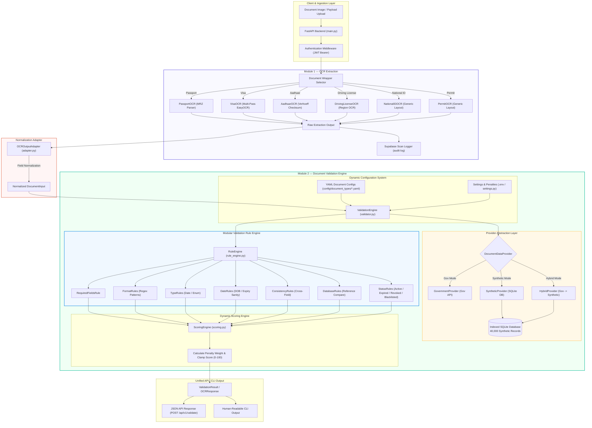

# VeriSight System Architecture

VeriSight is an AI-powered document verification platform designed for automated screening of passports, visas, national IDs, driving licenses, and permits.

---

## High-Level Pipeline Architecture & Data Flow

---

## Core Principles

1. **Fully Dynamic & Configuration-Driven:** All document types, required fields, format patterns, scoring weights, and rules are defined in YAML (`config/document_types/*.yaml`). Zero hardcoded `if doc_type == "passport"` branches in core validation logic.
2. **Provider Abstraction:** The `DocumentDataProvider` interface decouples reference lookup from data source. Supports `SyntheticProvider` (SQLite database with 35K+ seeded records), `GovernmentProvider` (official API integration architecture), and `HybridProvider`.
3. **Field-Aware Normalization:** Normalizes OCR digit/letter confusion (e.g. `O ↔ 0`, `I ↔ 1`, `S ↔ 5`, `B ↔ 8`) for numbers, cleans dates, and performs fuzzy name matching (`SequenceMatcher`).
4. **Scoring & Status Engine:** Calculates risk score (0–100) dynamically using configurable penalty weights from settings.
5. **Security Controls:** Never bypasses authentication, never uses leaked data, clearly labels synthetic data.
